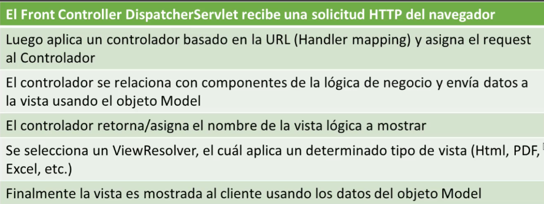

# Spring MVC

- Framework web para Java, toma ventajas de:
  - Modelo-Vista-Controlador (MVC)
  - Inyección de dependencias
  - Orientado a Interfaces
  - Uso de clases POJO
- Patrón de arquitectura
- 