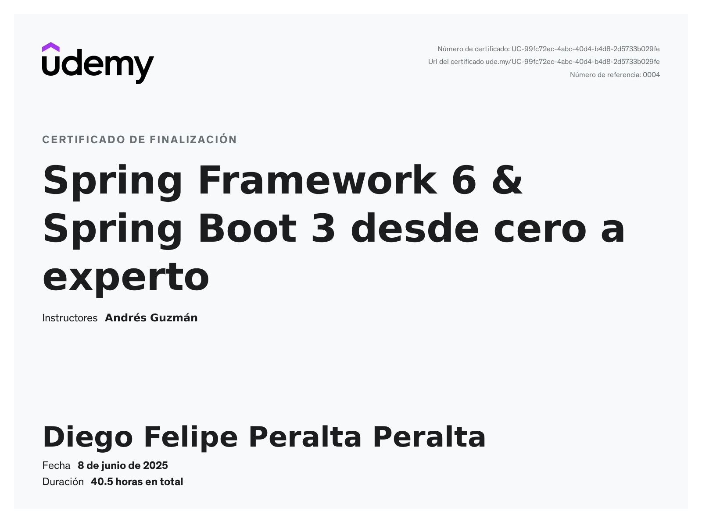

# Spring Framework 6 & Spring Boot 3 - Proyectos del Curso de Udemy

Este repositorio contiene todos los proyectos y notas creados durante el curso de Udemy "Spring Framework 6 & Spring Boot 3: De Cero a Experto" por Andrés Guzmán (udemy).

## Certificado del Curso de Udemy

## Proyectos del Curso

- `p01-springboot-web`: Proyecto enfocado en Spring Boot Web.
- `p02-springboot-di`: Proyecto enfocado en Inyección de Dependencias en Spring Boot.
- `p03-springboot-di-factura`: Proyecto enfocado en Inyección de Dependencias y Facturas en Spring Boot.
- `p04-springoot-error`: Proyecto enfocado en Manejo de Errores en Spring Boot.
- `p05-springboot-interceptor`: Proyecto enfocado en Interceptores en Spring Boot.
- `p06-springboot-interceptor-horario`: Proyecto enfocado en Interceptores y Horarios en Spring Boot.
- `p07-springboot-aop`: Proyecto enfocado en Programación Orientada a Aspectos en Spring Boot.
- `p08-sprinboot-jpa`: Proyecto enfocado en Spring Boot con JPA.
- `p09-springboot-jpa-relationship`: Proyecto enfocado en Relaciones JPA en Spring Boot.
- `p10-springboot-crud`: Proyecto enfocado en Operaciones CRUD en Spring Boot.
- `p11-spring-security-jwt`: Proyecto enfocado en Spring Security y JWT.
- `p12-auth-server`: Proyecto enfocado en Servidor de Autorización con Spring Security.
- `p12-client-app`: Proyecto enfocado en Aplicación Cliente con Spring Security.
- `p13-forntend-react-backend-springboot`: Proyecto enfocado en Frontend con React y Backend con Spring Boot.
- `p14-frontend-angular-backend-springboot`: Proyecto enfocado en Frontend con Angular y Backend con Spring Boot.

## Notas del Curso

- El directorio `1_notas` contiene apuntes detallados sobre varios temas cubiertos en el curso. Estas notas están organizadas en los siguientes temas principales:
  - Introducción a Spring Boot
  - Spring MVC
  - Inyección de Dependencias
  - Manejo de Errores
  - Interceptores
  - Programación Orientada a Aspectos (AOP)
  - JPA e Hibernate
  - Proyecto CRUD
  - JWT (JSON Web Tokens)
  - Despliegue
