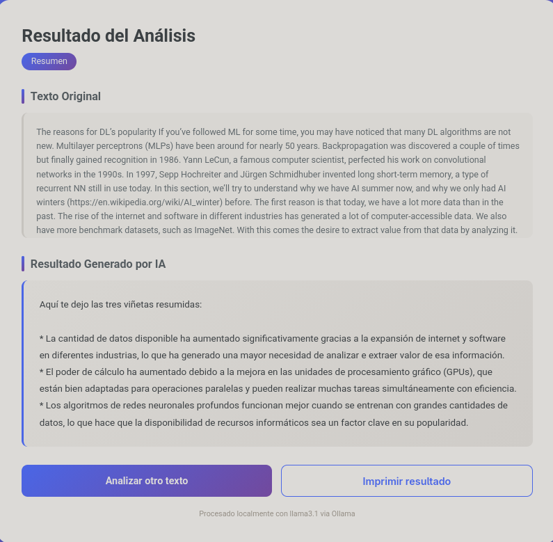
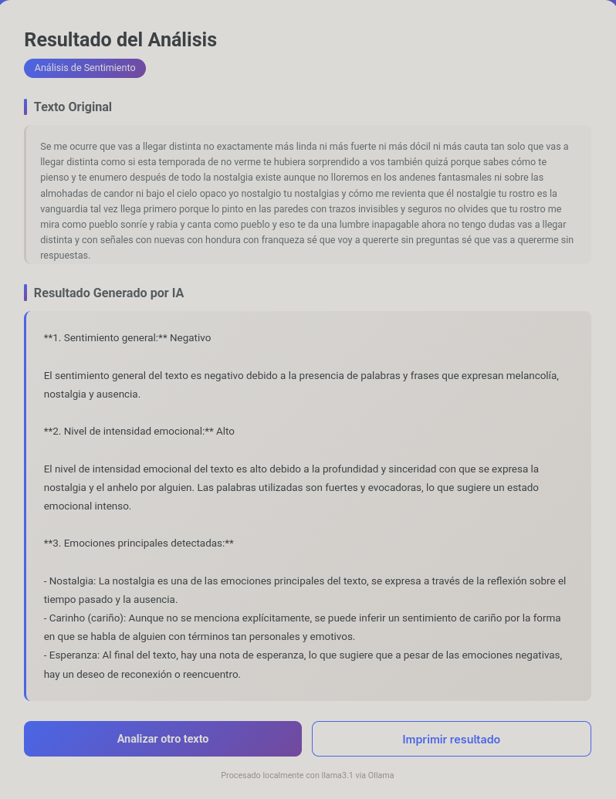
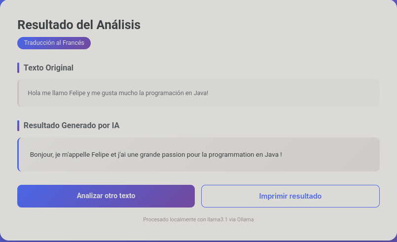
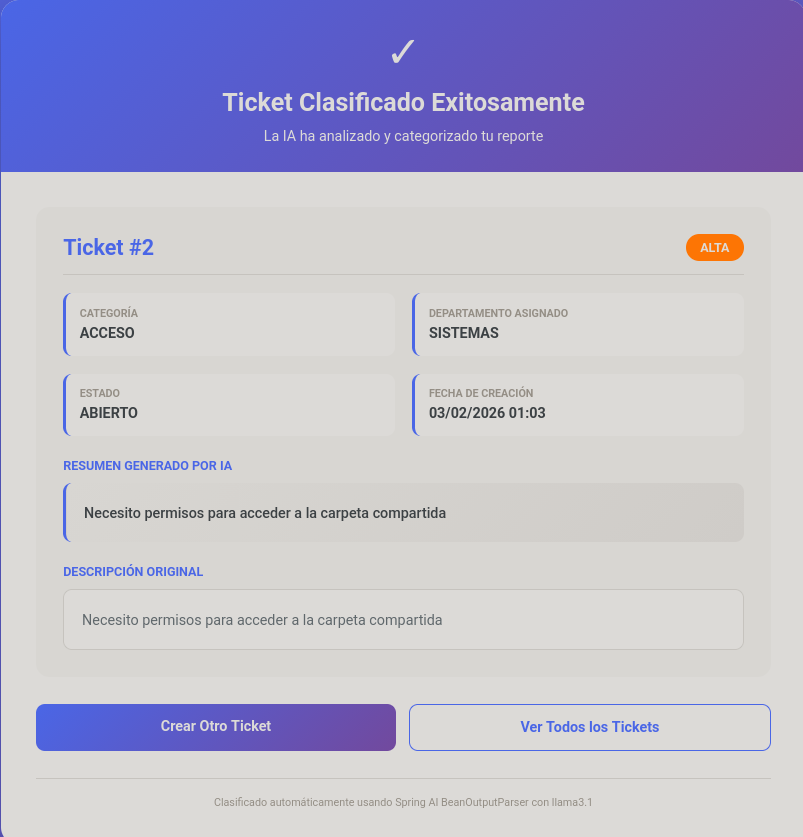
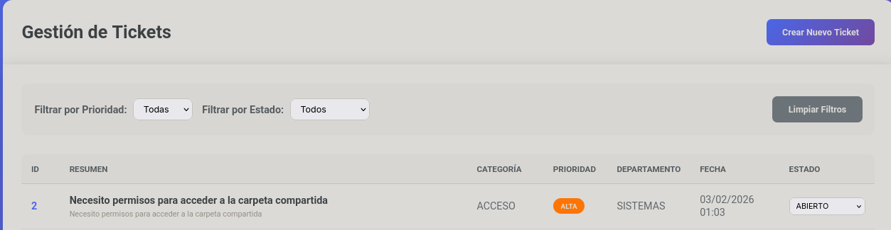
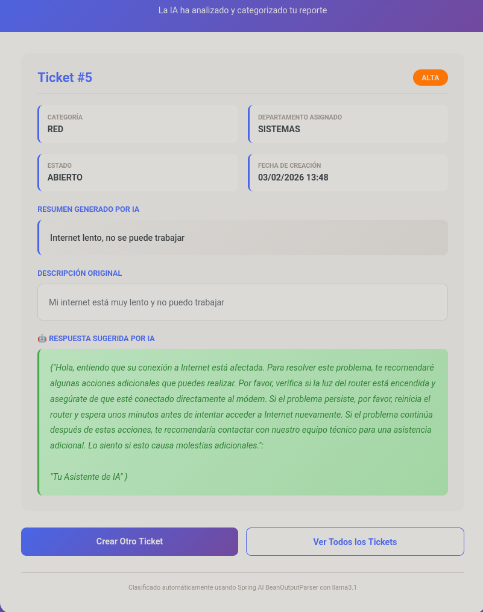
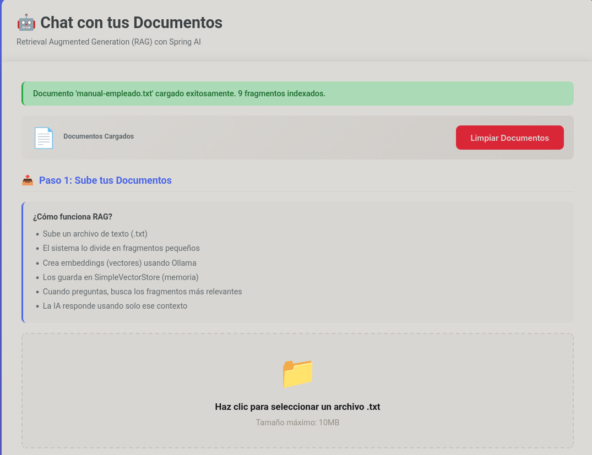
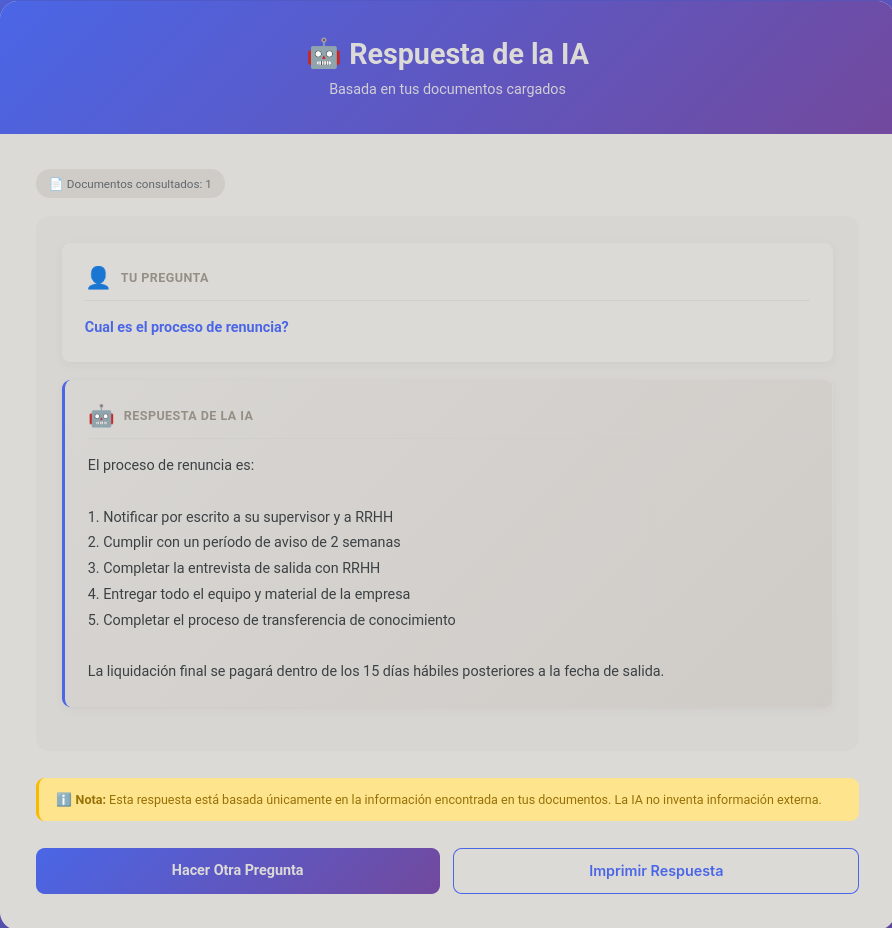

# 🤖 Aprendiendo Spring AI

Repositorio de aprendizaje progresivo de **Spring AI**, el framework oficial de Spring para integrar IA en aplicaciones Java. Tres proyectos que van desde lo básico hasta conceptos avanzados como RAG (Retrieval Augmented Generation).

## ¿Qué es este repositorio?

Este repositorio contiene 3 proyectos prácticos que te enseñan Spring AI de forma progresiva, utilizando **Ollama** para ejecutar modelos de IA localmente. Todos los proyectos son 100% privados - tus datos nunca salen de tu computadora.

## Proyectos Incluidos

### 1 spring-ai-example (Nivel Básico)

**Conceptos:** ChatClient y PromptTemplate

Un generador de resúmenes inteligente que convierte textos largos en 3 viñetas clave, además de analizar el sentimiento de cualquier texto.

**Tecnologías:**
- Spring AI ChatClient
- PromptTemplate para Prompt Engineering
- Ollama (llama3.1)
- Thymeleaf

**Características:**
- Resúmenes automáticos en 3 viñetas
- Análisis de sentimiento
- Traducción a francés
- Respuestas en texto plano (sin markdown)

**Capturas:**







[Ver README completo](spring-ai-example/README.md)

---

### 2 asistente-clasificacion (Nivel Intermedio)
**Conceptos:** BeanOutputParser y datos estructurados

Sistema de tickets de soporte técnico con clasificación automática por IA. La IA analiza el problema y lo categoriza automáticamente en categoría, prioridad y departamento. Además, puede generar respuestas sugeridas personalizadas para cada ticket.

**Tecnologías:**
- Spring AI BeanOutputParser
- Spring Data JPA
- SQLite
- Ollama (llama3.1)

**Características:**
- Clasificación automática de tickets
- Generación de respuestas sugeridas por IA
- Conversión JSON → Objetos Java
- Persistencia en SQLite
- Gestión de estados de tickets

**Capturas:**







[Ver README completo](asistente-clasificacion/README.md)

---

### 3 rag-simple (Nivel Avanzado)
**Conceptos:** RAG, Embeddings y búsqueda semántica

Chat con tus propios documentos. Sube archivos de texto y pregúntale a la IA sobre su contenido. La IA responde basándose ÚNICAMENTE en la información de tus documentos.

**Tecnologías:**
- Spring AI Embeddings
- Ollama (llama3.1 + nomic-embed-text)
- Búsqueda por similitud de coseno
- Vector embeddings

**Características:**
- Carga de documentos .txt
- Búsqueda semántica inteligente
- Embeddings con modelo nomic-embed-text
- Implementación educativa que muestra cómo funciona RAG internamente

**Capturas:**





[Ver README completo](rag-simple/README.md)

---

## Prerequisitos

Para ejecutar cualquiera de estos proyectos necesitas:

1. **Java 21** o superior
2. **Ollama** instalado y corriendo
3. **Modelos de Ollama** descargados:
   ```bash
   ollama pull llama3.1
   ollama pull nomic-embed-text  # Solo para rag-simple
   ```

Verificar instalación:
```bash
ollama list
curl http://localhost:11434/api/tags
```

## Cómo Usar

Cada proyecto se ejecuta de forma independiente:

```bash
# Proyecto 1: Resúmenes
cd spring-ai-example
./mvnw spring-boot:run

# Proyecto 2: Clasificación de Tickets
cd asistente-clasificacion
./mvnw spring-boot:run

# Proyecto 3: RAG
cd rag-simple
./mvnw spring-boot:run
```

Luego abre tu navegador en: **http://localhost:8080**

## Progresión de Aprendizaje

### Nivel 1: Fundamentos
Empieza con **spring-ai-example** para aprender:
- Cómo usar ChatClient
- Diseño de prompts con PromptTemplate
- Integración básica con Ollama

### Nivel 2: Estructuración
Continúa con **asistente-clasificacion** para dominar:
- BeanOutputParser para datos estructurados
- Conversión de respuestas IA → Java
- Integración con bases de datos

### Nivel 3: Avanzado
Finaliza con **rag-simple** para entender:
- Embeddings y vectores semánticos
- Búsqueda por similitud
- RAG (Retrieval Augmented Generation)
- Cómo funciona el "chat con documentos"

## Tecnologías

- **Spring Boot 4.0.2**
- **Spring AI 2.0.0-M2**
- **Ollama** (LLMs locales)
- **Thymeleaf** (vistas web)
- **SQLite** (proyecto 2)
- **Java 21**

## Conceptos de Spring AI Aprendidos

1. **ChatClient**: Cliente principal para interactuar con modelos de IA
2. **PromptTemplate**: Plantillas reutilizables para prompts
3. **BeanOutputParser**: Conversión automática JSON → Java
4. **EmbeddingModel**: Generación de vectores semánticos
5. **RAG**: Técnica para "chat con documentos"

## Casos de Uso Reales

Estos patrones se usan en:

- **Asistentes virtuales** corporativos
- **Chatbots** con conocimiento específico
- **Sistemas de soporte** con clasificación automática
- **Análisis de documentos** y extracción de información
- **Búsqueda semántica** en bases de conocimiento

## Características Destacadas

- **100% Local**: Todos los datos se procesan en tu máquina
- **Sin API Keys**: No necesitas cuentas de OpenAI, Anthropic, etc.
- **Open Source**: Modelos de código abierto via Ollama
- **Educativo**: Código comentado y READMEs detallados
- **Profesional**: Interfaces web modernas con Thymeleaf
- **Progresivo**: De básico a avanzado paso a paso

## Contribuciones

Este es un repositorio educativo personal. Si encuentras errores o mejoras, siéntete libre de sugerir cambios.

## Licencia

Proyecto educativo de código abierto.

---

**¿Por qué Spring AI?**

Spring AI es el framework oficial de Spring para IA, diseñado para Java developers que quieren integrar IA en sus aplicaciones Spring Boot sin tener que aprender Python o frameworks complejos. Es el futuro de la IA en el ecosistema Java.

**Próximos Pasos:**

Después de completar estos proyectos, considera explorar:
- Integración con bases de datos vectoriales (Chroma, Pinecone)
- Multi-modal AI (imágenes + texto)
- Function calling con herramientas
- Streaming de respuestas
- RAG con PDFs y otros formatos
