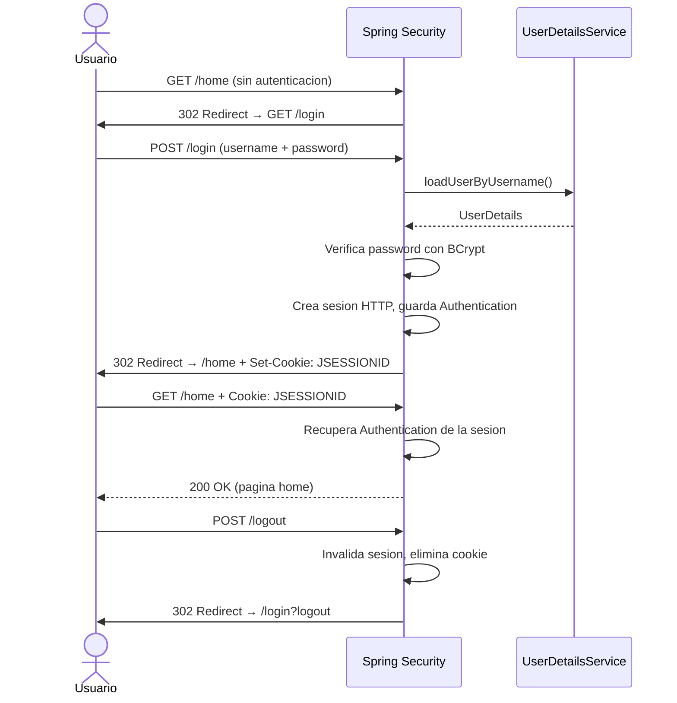
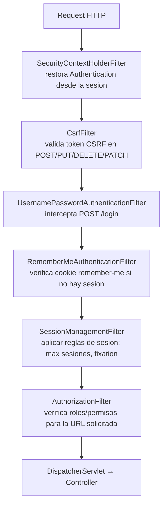
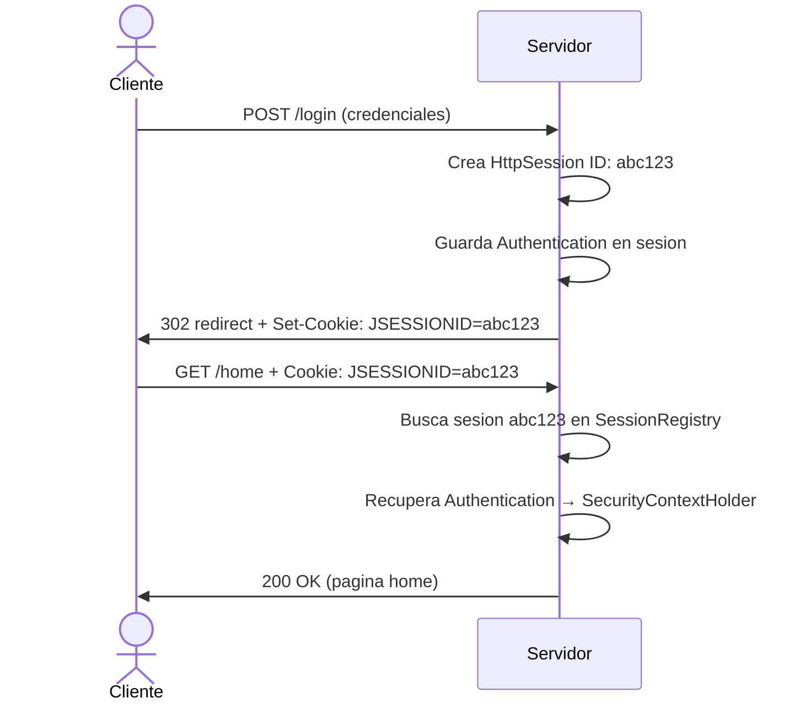

# Proyecto 02 - Form Login y Sesiones

## Objetivo

Este proyecto introduce el modelo de autenticacion stateful: el servidor recuerda quien eres entre requests usando una sesion HTTP. Cubre el mecanismo de form login, la proteccion CSRF, el manejo de sesiones, el remember-me y el logout correcto. Es el esquema clasico de aplicaciones web MVC con renderizado en servidor.

---

## Diferencia fundamental con el proyecto anterior

En HTTP Basic, cada request lleva las credenciales. El servidor no recuerda nada entre requests: es completamente stateless.

En Form Login, el flujo es diferente:



El servidor mantiene en memoria (o en un store externo) la sesion de cada usuario autenticado. Esto tiene implicaciones de escalabilidad: en arquitecturas de multiples instancias se requiere sesion compartida (Redis, base de datos).

---

## Dependencias

### `spring-boot-starter-security`

Igual que en el proyecto 01. Provee toda la infraestructura de Spring Security.

### `spring-boot-starter-thymeleaf`

Motor de plantillas HTML para el servidor. Permite renderizar paginas dinamicas con datos del servidor usando la sintaxis `th:*`. En este proyecto se usa para:
- Renderizar el formulario de login con el token CSRF inyectado automaticamente.
- Mostrar datos del usuario autenticado en las vistas.
- Manejar mensajes condicionales de error y logout.

Thymeleaf tiene integracion directa con Spring Security: cuando se usa `th:action` en un formulario, inyecta automaticamente un campo hidden con el token CSRF. Esto es posible porque Thymeleaf detecta la presencia de Spring Security en el classpath y activa su dialecto de seguridad.

### `thymeleaf-extras-springsecurity6`

Extension de Thymeleaf que agrega el dialecto `sec:*`. Permite usar expresiones de seguridad directamente en las plantillas HTML:

```html
<div sec:authorize="hasRole('ADMIN')">
    Solo visible para administradores
</div>

<span sec:authentication="name">nombre del usuario</span>
```

Importante: `sec:authorize` solo oculta o muestra elementos en la vista. No es una medida de seguridad real. La autorizacion real sigue estando en `SecurityConfig` y en los filtros de Spring Security. Un atacante que modifique el DOM o acceda directamente a la URL seguira siendo bloqueado por la configuracion del servidor.

---

## Arquitectura: filtros relevantes en este proyecto



---

## Implementacion

### `SecurityConfig.java`

#### Autorizacion de URLs

```java
.authorizeHttpRequests(auth -> auth
    .requestMatchers("/login").permitAll()
    .requestMatchers("/admin/**").hasRole("ADMIN")
    .anyRequest().authenticated()
)
```

Solo `/login` es publico. El resto requiere autenticacion. Las URLs bajo `/admin/` requieren adicionalmente el rol ADMIN.

#### Form Login

```java
.formLogin(form -> form
    .loginPage("/login")
    .defaultSuccessUrl("/home", true)
    .failureUrl("/login?error")
    .permitAll()
)
```

`loginPage("/login")`: define la URL del formulario personalizado. Spring Security registra automaticamente:
- `GET /login` -> el controlador devuelve la vista `login.html`
- `POST /login` -> procesado por `UsernamePasswordAuthenticationFilter`, nunca
  llega al controlador

`defaultSuccessUrl("/home", true)`: el segundo parametro `true` fuerza la redireccion a `/home` siempre. Con `false`, si el usuario intentaba acceder a `/perfil` antes del login, Spring lo redirige a `/perfil` tras autenticarse. Spring guarda la URL original en `SavedRequest` dentro de la sesion.

`failureUrl("/login?error")`: tras credenciales incorrectas, Spring redirige a esta URL. El parametro `?error` no tiene significado para Spring; es simplemente un indicador que el template usa con `th:if="${param.error}"` para mostrar el mensaje de error.

`permitAll()`: registra que las URLs de login (GET y POST /login) son publicas, sin necesidad de repetirlas en `authorizeHttpRequests`.

#### Logout

```java
.logout(logout -> logout
    .logoutUrl("/logout")
    .logoutSuccessUrl("/login?logout")
    .invalidateHttpSession(true)
    .deleteCookies("JSESSIONID")
)
```

El logout debe hacerse via POST para que CSRF lo proteja. Si se permitiera logout via GET, un sitio malicioso podria incrustar un link `` y cerrar la sesion del usuario sin que este lo sepa.

`invalidateHttpSession(true)`: llama a `HttpSession.invalidate()`, liberando todos los atributos almacenados en la sesion del servidor.

`deleteCookies("JSESSIONID")`: instruye al servidor a enviar una cookie con `Max-Age=0` en la respuesta, lo que hace que el navegador la elimine.

#### Remember-Me

```java
.rememberMe(remember -> remember
    .key("uniqueAndSecretKey")
    .tokenValiditySeconds(86400)
)
```

Cuando el usuario marca el checkbox `remember-me` en el formulario, Spring genera una cookie con este contenido (algoritmo hash por defecto):

```
base64( username + ":" + expirationTime + ":" +
        md5( username + ":" + expirationTime + ":" + password + ":" + key ) )
```

Al volver con la sesion expirada pero la cookie presente, `RememberMeAuthenticationFilter` la decodifica, verifica el hash y re-autentica al usuario automaticamente.

La `key` debe ser secreta y estable entre reinicios del servidor. Si cambia, todos los tokens remember-me existentes quedan invalidos. En produccion debe provenir de configuracion externa, no del codigo fuente.

#### Session Management

```java
.sessionManagement(session -> session
    .maximumSessions(1)
)
```

Limita a una sesion activa por usuario. Si el mismo usuario se autentica desde otro navegador, la sesion anterior queda invalidada.

Spring Security tambien aplica **session fixation protection** por defecto. Al autenticarse exitosamente, migra los atributos de sesion a una nueva sesion con nuevo ID, e invalida el ID anterior. Esto previene ataques donde un atacante pre-establece un ID de sesion y espera a que la victima se autentique con el.

---

### `PageController.java`

Usa `@Controller` (no `@RestController`) porque los metodos retornan nombres de vistas, no datos. Spring MVC pasa el nombre al `ThymeleafViewResolver`, que busca el archivo en `src/main/resources/templates/<nombre>.html`.

El parametro `Authentication authentication` es inyectado por Spring MVC desde el `SecurityContextHolder`. Solo esta disponible si el usuario esta autenticado; en endpoints publicos seria `null`.

---

### Templates

#### `login.html`

El punto critico es el formulario:

```html
<form method="post" th:action="@{/login}">
```

`th:action` (en lugar del atributo HTML `action` comun) hace que Thymeleaf:
1. Resuelva la URL correctamente con el context path.
2. Inyecte automaticamente el campo hidden con el token CSRF:
   `<input type="hidden" name="_csrf" value="..."/>`

Los nombres de los campos `username` y `password` son los que `UsernamePasswordAuthenticationFilter` busca por defecto.

El checkbox `remember-me` tiene el nombre `remember-me`, que es el nombre que el filtro correspondiente espera por defecto.

Los bloques condicionales:
```html
<p th:if="${param.error}">...</p>
<p th:if="${param.logout}">...</p>
```
Usan `param`, que en Thymeleaf representa los parametros de la URL. Aparecen solo cuando la URL tiene `?error` o `?logout` respectivamente.

#### `home.html`

El logout es un formulario POST, no un link, por las razones explicadas arriba.

`sec:authorize="hasRole('ADMIN')"` oculta el link al panel de admin para usuarios sin ese rol. Este atributo lo provee `thymeleaf-extras-springsecurity6` y evalua la misma expresion SpEL que se usaria en `SecurityConfig`.

#### `admin.html`

Este template solo se renderiza si Spring Security ya aprobo el acceso en la capa del filtro. El controlador no necesita verificar el rol porque la configuracion de seguridad lo garantiza antes de llegar aqui.

---

## CSRF: que es y por que importa

Cross-Site Request Forgery (CSRF) es un ataque donde un sitio malicioso fuerza al navegador de un usuario autenticado a hacer requests a tu aplicacion sin que el usuario lo sepa.

Ejemplo del ataque:
1. Usuario se autentica en `bank.com` y tiene una cookie de sesion.
2. Usuario visita `evil.com`, que tiene: `<form action="bank.com/transfer" method="post">`.
3. El navegador envia el POST a `bank.com` con la cookie de sesion automaticamente.
4. Sin CSRF protection, `bank.com` procesa la transferencia como si fuera legitima.

Defensa de Spring Security:
- Genera un token unico por sesion (el CSRF token).
- Lo requiere en cada request que modifica estado (POST, PUT, DELETE, PATCH).
- El sitio malicioso no puede conocer el CSRF token porque no puede leer la
  sesion ni las respuestas del servidor (same-origin policy).
- Thymeleaf inyecta el token automaticamente en formularios con `th:action`.

CSRF protection se activa por defecto en Spring Security para aplicaciones stateful (con sesion). En APIs REST stateless (JWT) generalmente se desactiva porque no hay sesion y no hay cookies de sesion que explotar.

---

## Sesion HTTP: como funciona



La sesion se almacena en memoria del servidor por defecto (`HttpSessionSecurityContextRepository`).
En produccion con multiples instancias se necesita almacenamiento externo (Redis, JDBC).

---

## Como ejecutar

```bash
./mvnw spring-boot:run
```

Abrir en el navegador: `http://localhost:8080`

Sera redirigido automaticamente a `/login`.

Credenciales disponibles:
- `user` / `user123` - rol USER
- `admin` / `admin123` - roles ADMIN y USER

---

## Flujos a verificar manualmente

| Accion | Resultado esperado |
|---|---|
| Acceder a `http://localhost:8080` sin sesion | Redirige a `/login` |
| Login con `user` / `user123` | Redirige a `/home`, muestra `[ROLE_USER]` |
| Login con credenciales incorrectas | Vuelve a `/login` con mensaje de error |
| Acceder a `/admin` siendo `user` | 403 Forbidden |
| Login con `admin` / `admin123` | Muestra link al panel de admin |
| Acceder a `/admin` siendo `admin` | Panel de administracion |
| Logout | Redirige a `/login?logout` con mensaje de confirmacion |
| Marcar "Recordarme", hacer login, cerrar navegador y volver | Re-autenticacion automatica |

---

## Limitaciones de este enfoque

- Los usuarios siguen estando en memoria: se pierden al reiniciar. Se resuelve en el proyecto 03 (JDBC) y 04 (JPA).
- El remember-me por hash depende de que el password no cambie. Si el usuario cambia su password, todos sus tokens remember-me quedan invalidos.
- La sesion se almacena en memoria del servidor: no escala horizontalmente sin sesion compartida.
- Thymeleaf y la renderizacion en servidor no es el patron dominante hoy. Las APIs REST con clientes JavaScript/movil usan JWT (proyecto 06).
