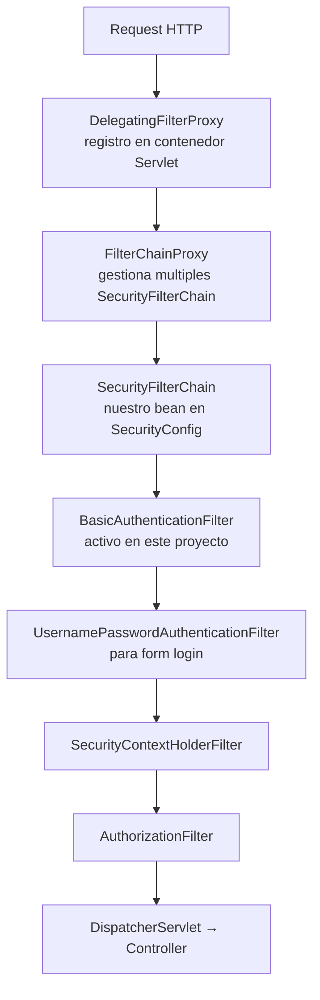

# Proyecto 01 - HTTP Basic con usuarios en memoria

## Objetivo

Este proyecto es el punto de entrada a Spring Security. Su proposito es entender la arquitectura base del framework: como intercepta los requests, como verifica identidades y como toma decisiones de acceso. Todo esto sin base de datos, sin tokens y sin sesiones. Solo el mecanismo mas elemental que existe: HTTP Basic Authentication con usuarios definidos en codigo.

---

## Dependencias

### `spring-boot-starter-webmvc`

Starter de Spring MVC. Provee el servidor embebido (Tomcat por defecto), el DispatcherServlet, la infraestructura para `@RestController`, `@GetMapping`, etc. Es la base sobre la que Spring Security opera: intercepta los requests HTTP antes de que lleguen al controlador.

### `spring-boot-starter-security`

Starter de Spring Security. Al incluirlo en el classpath, Spring Boot activa su auto-configuracion y suceden tres cosas automaticamente:

1. Se registra un `DelegatingFilterProxy` en el contenedor de Servlets, que delega en el `FilterChainProxy` de Spring Security. Este es el punto de entrada de toda la logica de seguridad.
2. Se protegen todos los endpoints por defecto (requieren autenticacion).
3. Si no se define un `UserDetailsService`, se genera un usuario llamado `user` con un password aleatorio que se imprime en el log del arranque.

Al definir nuestros propios beans `SecurityFilterChain` y `UserDetailsService`, anulamos el comportamiento por defecto y tomamos control total de la configuracion.

---

## Arquitectura de Spring Security: el FilterChain

Spring Security opera como una cadena de filtros Servlet (`FilterChain`) que se ejecutan antes de que el request llegue al `DispatcherServlet` de Spring MVC.



El `BasicAuthenticationFilter` lee el header `Authorization: Basic <base64>`, decodifica las credenciales, las verifica contra el `UserDetailsService`, y si son validas, coloca el objeto `Authentication` en el `SecurityContextHolder`. Luego el `AuthorizationFilter` consulta ese contexto para decidir si el usuario tiene permiso para acceder a la URL solicitada.

---

## Implementacion

### `SecurityConfig.java`

```
config/SecurityConfig.java
```

Esta clase es la pieza central. Esta anotada con `@Configuration` y
`@EnableWebSecurity`. Define tres beans:

#### Bean `SecurityFilterChain`

```java
@Bean
public SecurityFilterChain securityFilterChain(HttpSecurity http) throws Exception {
    http
        .authorizeHttpRequests(auth -> auth
            .requestMatchers("/public/**").permitAll()
            .requestMatchers("/admin/**").hasRole("ADMIN")
            .anyRequest().authenticated()
        )
        .httpBasic(Customizer.withDefaults());
    return http.build();
}
```

`HttpSecurity` es el builder del DSL de Spring Security. Permite configurar:

- `authorizeHttpRequests`: define las reglas de autorizacion por URL. Las reglas se evaluan en orden, la primera que coincide gana. Por eso el orden importa: si se pusiera `anyRequest().authenticated()` antes de `permitAll()`, el endpoint publico quedaria bloqueado.

- `requestMatchers("/public/**").permitAll()`: cualquier URL que empiece con `/public/` es accesible sin autenticacion.

- `requestMatchers("/admin/**").hasRole("ADMIN")`: solo usuarios con el rol `ROLE_ADMIN` pueden acceder. Internamente Spring Security busca `ROLE_ADMIN` en la coleccion de `GrantedAuthority` del usuario. El prefijo `ROLE_` es agregado automaticamente por `hasRole()`.

- `anyRequest().authenticated()`: todo lo demas requiere estar autenticado con cualquier rol.

- `httpBasic(Customizer.withDefaults())`: activa el `BasicAuthenticationFilter`. En cada request el cliente debe enviar el header: `Authorization: Basic base64(username:password)`

#### Bean `UserDetailsService`

```java
@Bean
public UserDetailsService userDetailsService(PasswordEncoder passwordEncoder) {
    UserDetails user = User.builder()
            .username("user")
            .password(passwordEncoder.encode("user123"))
            .roles("USER")
            .build();

    UserDetails admin = User.builder()
            .username("admin")
            .password(passwordEncoder.encode("admin123"))
            .roles("ADMIN", "USER")
            .build();

    return new InMemoryUserDetailsManager(user, admin);
}
```

`UserDetailsService` es la interfaz central de autenticacion en Spring Security. Tiene un unico metodo: `loadUserByUsername(String username)`. Cuando el `BasicAuthenticationFilter` recibe credenciales, llama a este metodo para obtener el `UserDetails` asociado al username, y luego compara el password del request contra el hash almacenado usando el `PasswordEncoder`.

`InMemoryUserDetailsManager` implementa esta interfaz guardando los usuarios en un `ConcurrentHashMap`. Util para desarrollo y tests; no escala ni persiste datos.

`User.builder()` construye un `UserDetails`. Al usar `.roles("USER")`, internamente se transforma en `.authorities("ROLE_USER")`. Spring Security exige este prefijo para el mecanismo `hasRole()`.

El `PasswordEncoder` se inyecta como parametro del metodo para evitar dependencias circulares si se definiera todo en un mismo bean.

#### Bean `PasswordEncoder`

```java
@Bean
public PasswordEncoder passwordEncoder() {
    return new BCryptPasswordEncoder();
}
```

`BCryptPasswordEncoder` implementa el algoritmo BCrypt. Sus caracteristicas:

- Genera una sal aleatoria de 128 bits e incluida en el hash resultante.
- Aplica un factor de costo (por defecto 10 rondas de hashing). A mayor costo, mas tiempo tarda la verificacion, lo que dificulta los ataques de fuerza bruta.
- El hash resultante es siempre diferente aunque el password sea el mismo, porque la sal es aleatoria. La verificacion funciona porque la sal esta embebida en el hash y BCrypt sabe como extraerla.
- Es irreversible: no existe forma de obtener el password original desde el hash.

Nunca se debe almacenar passwords en texto plano ni con hashes debiles (MD5, SHA1).

---

### `DemoController.java`

```
controller/DemoController.java
```

Expone tres endpoints con distintos niveles de acceso para verificar el comportamiento de la configuracion:

| Endpoint | Acceso configurado | Comportamiento esperado |
|---|---|---|
| `GET /public/hello` | `permitAll()` | Responde 200 sin credenciales |
| `GET /hello` | `authenticated()` | Requiere cualquier usuario valido |
| `GET /admin/info` | `hasRole("ADMIN")` | Solo usuario `admin` |

El parametro `Authentication authentication` en los metodos del controlador es
inyectado automaticamente por Spring MVC desde el `SecurityContextHolder`. Contiene:

- `getName()`: el username del usuario autenticado.
- `getAuthorities()`: la coleccion de roles, ej. `[ROLE_USER, ROLE_ADMIN]`.
- `getPrincipal()`: el objeto `UserDetails` completo.

---

## Comportamiento de HTTP Basic

HTTP Basic es un mecanismo estandar definido en RFC 7617. El cliente codifica `username:password` en Base64 y lo envia en cada request:

```
Authorization: Basic dXNlcjp1c2VyMTIz
```

`dXNlcjp1c2VyMTIz` es `user:user123` en Base64. No es cifrado: cualquiera que intercepte la comunicacion puede decodificarlo. Por esta razon HTTP Basic solo debe usarse sobre HTTPS en entornos reales.

Cuando Spring Security no puede autenticar un request protegido, responde con:

```
HTTP/1.1 401 Unauthorized
WWW-Authenticate: Basic realm="Realm"
```

El header `WWW-Authenticate` indica al cliente que mecanismo usar. Los navegadores web muestran un dialogo nativo de credenciales al recibirlo.

---

## Diferencia entre 401 y 403

| Codigo | Significado | Causa en este proyecto |
|---|---|---|
| 401 Unauthorized | No autenticado | Request sin credenciales o con credenciales incorrectas |
| 403 Forbidden | Autenticado pero sin permiso | Usuario `user` accediendo a `/admin/**` |

---

## Como ejecutar

```bash
./mvnw spring-boot:run
```

La aplicacion inicia en el puerto 8080 por defecto.

---

## Como probar con curl

```bash
# Endpoint publico: responde 200 sin credenciales
curl -i http://localhost:8080/public/hello

# Sin credenciales en endpoint protegido: responde 401
curl -i http://localhost:8080/hello

# Usuario USER autenticado: responde 200
curl -i -u user:user123 http://localhost:8080/hello

# Usuario ADMIN en endpoint admin: responde 200
curl -i -u admin:admin123 http://localhost:8080/admin/info

# Usuario USER en endpoint admin: responde 403
curl -i -u user:user123 http://localhost:8080/admin/info

# Credenciales incorrectas: responde 401
curl -i -u user:wrongpassword http://localhost:8080/hello
```

---

## Respuestas esperadas

```
GET /public/hello
-> 200 OK
-> "Endpoint publico: no se requiere autenticacion."

GET /hello  (con -u user:user123)
-> 200 OK
-> "Hola, user. Roles asignados: [ROLE_USER]"

GET /admin/info  (con -u admin:admin123)
-> 200 OK
-> "Panel de administracion. Usuario: admin | Authorities: [ROLE_ADMIN, ROLE_USER]"

GET /admin/info  (con -u user:user123)
-> 403 Forbidden

GET /hello  (sin credenciales)
-> 401 Unauthorized
```

---

## Limitaciones de este enfoque

Este proyecto es exclusivamente didactico. En una aplicacion real:

- Los usuarios no se definen en codigo: provienen de una base de datos.
- Los passwords no se hardcodean: se leen de configuracion segura o se registran
  via formulario con hashing en el momento del registro.
- HTTP Basic sobre HTTP plano es inseguro: debe usarse unicamente con HTTPS.
- HTTP Basic no tiene mecanismo de logout real: el cliente simplemente deja de
  enviar el header, pero no hay invalidacion de sesion porque no hay sesion.

Estos problemas se resuelven en los proyectos siguientes.
