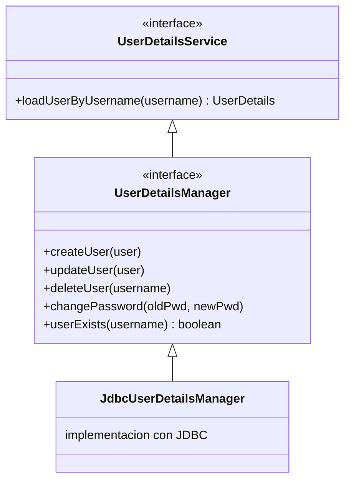

# Proyecto 03 - Autenticacion JDBC

## Objetivo

Introducir el primer almacenamiento real de usuarios. En lugar de tenerlos en memoria o en codigo, se persisten en una base de datos relacional usando el esquema oficial de Spring Security. Se introduce `JdbcUserDetailsManager`, la consola H2 para inspeccionar los datos en vivo, y un flujo de registro de nuevos usuarios.

---

## Diferencia con los proyectos anteriores

| Aspecto | Proyecto 01 y 02 | Proyecto 03 |
|---|---|---|
| Origen de usuarios | Codigo Java (`InMemoryUserDetailsManager`) | Base de datos (`JdbcUserDetailsManager`) |
| Persistencia | No persiste entre reinicios | Persiste mientras H2 este en memoria |
| Gestion de usuarios | Solo lectura en runtime | Crear, actualizar, eliminar en runtime |
| Inspeccion | Solo logs | Consola H2 con SQL directo |

---

## Dependencias

### `spring-boot-starter-security`

Igual que en proyectos anteriores.

### `spring-boot-starter-thymeleaf` + `thymeleaf-extras-springsecurity6`

Motor de plantillas y dialecto de seguridad. Igual que en proyecto 02.

### `spring-boot-starter-jdbc`

Provee:
- Auto-configuracion de `DataSource` a partir de las propiedades en `application.properties`.
- `JdbcTemplate`: wrapper sobre JDBC que elimina el boilerplate de manejo de conexiones, `PreparedStatement` y `ResultSet`.
- Integracion con `spring.sql.init` para ejecutar `schema.sql` al arrancar.

No incluye JPA ni ningun ORM. Es JDBC puro, que es exactamente lo que `JdbcUserDetailsManager` usa internamente.

### `com.h2database:h2` (scope runtime)

Base de datos relacional embebida escrita en Java. Se ejecuta dentro de la misma JVM de la aplicacion, sin proceso separado. `scope runtime` indica que no se necesita en tiempo de compilacion, solo en ejecucion.

Modos de H2:
- **In-memory** (`jdbc:h2:mem:nombre`): los datos viven en memoria y desaparecen al detener la aplicacion. Usado en este proyecto.
- **File** (`jdbc:h2:file:/ruta/archivo`): persiste en disco como SQLite.
- **Server** (`jdbc:h2:tcp://host/ruta`): modo cliente-servidor como PostgreSQL.

En produccion se reemplazaria H2 por PostgreSQL, MySQL u otro. Solo se necesita cambiar el driver y la URL en `application.properties`; el codigo de Spring Security no cambia.

---

## El esquema JDBC de Spring Security

Spring Security define un esquema minimo de dos tablas que `JdbcUserDetailsManager` espera encontrar. Ese esquema esta en `schema.sql`:

```sql
CREATE TABLE users (
    username  VARCHAR(50)  NOT NULL PRIMARY KEY,
    password  VARCHAR(500) NOT NULL,
    enabled   BOOLEAN      NOT NULL
);

CREATE TABLE authorities (
    username  VARCHAR(50) NOT NULL,
    authority VARCHAR(50) NOT NULL,
    CONSTRAINT fk_authorities_users FOREIGN KEY (username) REFERENCES users (username)
);

CREATE UNIQUE INDEX ix_auth_username ON authorities (username, authority);
```

### Tabla `users`

- `username`: identificador unico del usuario. Clave primaria.
- `password`: hash BCrypt del password. Spring Security nunca almacena texto plano. La columna usa 500 caracteres por convencion defensiva; BCrypt produce 60.
- `enabled`: permite deshabilitar un usuario sin eliminarlo. `JdbcUserDetailsManager` filtra usuarios con `enabled = false` en su query de autenticacion.

### Tabla `authorities`

Relacion uno-a-muchos con `users`. Un usuario puede tener multiples authorities. El nombre del authority debe incluir el prefijo `ROLE_` para que funcione con `hasRole()` en `SecurityConfig`. Ejemplos: `ROLE_USER`, `ROLE_ADMIN`.

### Indice unico `ix_auth_username`

Previene que el mismo authority se asigne dos veces al mismo usuario. Sin este indice, un bug en `createUser()` podria duplicar filas en `authorities` sin error, causando comportamiento indefinido.

### Queries internas de JdbcUserDetailsManager

Cuando Spring Security necesita autenticar a un usuario, `JdbcUserDetailsManager` ejecuta estas queries SQL por defecto:

```sql
-- Para cargar el usuario:
SELECT username, password, enabled FROM users WHERE username = ?

-- Para cargar sus authorities:
SELECT username, authority FROM authorities WHERE username = ?
```

Estas queries se pueden sobreescribir para adaptarse a esquemas existentes:

```java
JdbcUserDetailsManager manager = new JdbcUserDetailsManager(dataSource);
manager.setUsersByUsernameQuery("SELECT email, pwd, active FROM my_users WHERE email = ?");
manager.setAuthoritiesByUsernameQuery("SELECT email, role FROM my_roles WHERE email = ?");
```

---

## Implementacion

### `SecurityConfig.java`

#### Bean `JdbcUserDetailsManager`

```java
@Bean
public JdbcUserDetailsManager userDetailsManager(DataSource dataSource) {
    return new JdbcUserDetailsManager(dataSource);
}
```

Se devuelve `JdbcUserDetailsManager` en lugar de la interfaz `UserDetailsService`. esto es intencional: `JdbcUserDetailsManager` implementa `UserDetailsManager`, que extiende `UserDetailsService` con operaciones de escritura:



Al exponer el tipo concreto, `DataInitializer` y `PageController` pueden inyectarlo directamente y usar todos sus metodos sin casting.

#### Configuracion especial para H2 Console

```java
.csrf(csrf -> csrf
    .ignoringRequestMatchers("/h2-console/**")
)
.headers(headers -> headers
    .frameOptions(frameOptions -> frameOptions.sameOrigin())
)
```

La consola H2 es una aplicacion web de terceros que usa iframes y no implementa CSRF. Para que funcione en desarrollo se necesitan dos ajustes:

1. **Excluir del CSRF**: la consola hace POST a sus propias URLs sin el token CSRF de Spring Security. `ignoringRequestMatchers` indica que esas URLs no deben validar el token.

2. **Permitir frames del mismo origen**: Spring Security agrega por defecto el header `X-Frame-Options: DENY`, que hace que los navegadores rechacen cualquier intento de cargar la pagina en un frame o iframe. `frameOptions.sameOrigin()` cambia el header a `X-Frame-Options: SAMEORIGIN`, permitiendo frames cuyo origen sea el mismo dominio.

---

### `DataInitializer.java`

Implementa `ApplicationRunner`. Su metodo `run()` se ejecuta una vez, justo despues de que el contexto de Spring este listo y antes de que la aplicacion acepte trafico. Es el lugar correcto para inicializacion que depende de beans.

El metodo `userExists()` hace un `SELECT COUNT(*) FROM users WHERE username = ?`. Esto garantiza idempotencia: si la base de datos ya tiene el usuario (por ejemplo con H2 file-based), no se duplica.

---

### `PageController.java` - registro de usuarios

```java
@PostMapping("/register")
public String registerUser(@RequestParam String username,
                           @RequestParam String password,
                           Model model) {
    if (userDetailsManager.userExists(username)) {
        model.addAttribute("error", "El nombre de usuario ya esta en uso.");
        return "register";
    }

    UserDetails nuevoUsuario = User.builder()
            .username(username)
            .password(passwordEncoder.encode(password))
            .authorities("ROLE_USER")
            .build();

    userDetailsManager.createUser(nuevoUsuario);
    return "redirect:/login?registered";
}
```

`createUser()` ejecuta dos INSERTs:
```sql
INSERT INTO users (username, password, enabled) VALUES (?, ?, true)
INSERT INTO authorities (username, authority) VALUES (?, ?)
```

El password que llega al INSERT es el hash BCrypt, nunca el texto plano. La base de datos solo almacena hashes. Esto se puede verificar en la consola H2 ejecutando:
```sql
SELECT * FROM users;
SELECT * FROM authorities;
```

---

## Inspeccion con la consola H2

1. Levantar la aplicacion.
2. Abrir: `http://localhost:8080/h2-console`
3. En el campo "JDBC URL" ingresar: `jdbc:h2:mem:securitydb`
4. Username: `sa`, Password: (vacio)
5. Click en "Connect"

Queries utiles:
```sql
-- Ver todos los usuarios y sus hashes
SELECT * FROM users;

-- Ver todos los roles asignados
SELECT * FROM authorities;

-- Ver usuarios con sus roles (JOIN)
SELECT u.username, u.enabled, a.authority
FROM users u
JOIN authorities a ON u.username = a.username
ORDER BY u.username;
```

---

## application.properties

```properties
spring.datasource.url=jdbc:h2:mem:securitydb;DB_CLOSE_DELAY=-1;DB_CLOSE_ON_EXIT=FALSE
```

`DB_CLOSE_DELAY=-1`: mantiene la base de datos viva mientras la JVM este corriendo. Sin este parametro, H2 cierra la base de datos cuando la ultima conexion del pool se devuelve, y los datos se pierden entre requests.

```properties
spring.sql.init.mode=always
```

Fuerza la ejecucion de `schema.sql` al arrancar. Para bases de datos embebidas Spring Boot lo hace por defecto, pero la propiedad explicita deja claro la intencion.

---

## Como ejecutar

```bash
./mvnw spring-boot:run
```

Abrir: `http://localhost:8080`

Credenciales pre-cargadas por `DataInitializer`:
- `user` / `user123` - rol ROLE_USER
- `admin` / `admin123` - roles ROLE_ADMIN y ROLE_USER

---

## Flujos a verificar

| Accion | Resultado esperado |
|---|---|
| Login con `user` / `user123` | Acceso a `/home` |
| Login con `admin` / `admin123` | Acceso a `/home` y `/admin` |
| Registrar usuario nuevo desde `/register` | Redirige a `/login?registered` |
| Login con el usuario recien registrado | Acceso a `/home` |
| Intentar registrar username duplicado | Mensaje de error en el formulario |
| Login con `user` e ir a `/admin` | 403 Forbidden |
| Ver consola H2 y ejecutar `SELECT * FROM users` | Hashes BCrypt visibles |

---

## Limitaciones de este enfoque

- El esquema de dos tablas de Spring Security es minimo. Aplicaciones reales necesitan mas campos: email, fecha de creacion, intentos fallidos de login, fecha de expiracion del password, etc. Eso requiere un esquema personalizado con `UserDetailsService` propio, que es exactamente lo que se introduce en el proyecto 04 con JPA.

- Los passwords no se validan en el registro (longitud minima, complejidad). En produccion se usaria un validador o Bean Validation.

- `JdbcUserDetailsManager` usa JDBC puro. Cuando el modelo de datos crece, JPA con entidades es mas mantenible. La transicion se ve en el proyecto 04.

- La base de datos H2 en memoria no persiste entre reinicios. Para desarrollo persistente se cambia la URL a `jdbc:h2:file:./data/securitydb`.
